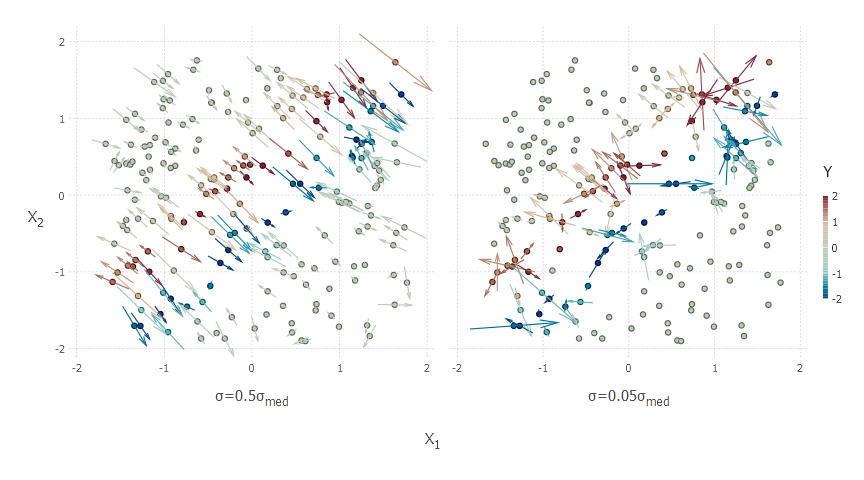

<a id='CoupledFields.jl-Documentation-1'></a>

# CoupledFields.jl Documentation


<a id='Types-1'></a>

## Types

<a id='CoupledFields.ModelObj' href='#CoupledFields.ModelObj'>#</a>
**`CoupledFields.ModelObj`** &mdash; *Type*.


```
ModelObj: A type to hold statistical model results
```

Such as the matrices `W, R, A, T`, where `R=XW` and `T=YA`.  

<a id='CoupledFields.KernelParameters' href='#CoupledFields.KernelParameters'>#</a>
**`CoupledFields.KernelParameters`** &mdash; *Type*.


```
KernelParameters: An abstract type.
```

All KernelParameters types contain Kf and ∇Kf i.e. a kernel function and its first derivative. Some instances also contain other parameters which are later passed to Kf and ∇Kf. 

A KernelParameters type can be set using e.g. `PolynomialKP()` or `PolynomialKP(X::Matrix{Float64})`. The two forms are provided for consistency. 

<a id='CoupledFields.GaussianKP' href='#CoupledFields.GaussianKP'>#</a>
**`CoupledFields.GaussianKP`** &mdash; *Type*.


```
GaussianKP: For the gaussian kernel
```

<a id='CoupledFields.PolynomialKP' href='#CoupledFields.PolynomialKP'>#</a>
**`CoupledFields.PolynomialKP`** &mdash; *Type*.


```
PolynomialKP: For the polynomial kernel
```


<a id='Functions-1'></a>

## Functions

<a id='CoupledFields.bf-Tuple{Array{Float64,1},Int64}' href='#CoupledFields.bf-Tuple{Array{Float64,1},Int64}'>#</a>
**`CoupledFields.bf`** &mdash; *Method*.


```
bf(x::Vector{Float64}, df::Int):
```

Compute a piecewise linear basis matrix for the vector x.

<a id='CoupledFields.cca-Tuple{Array{Float64,N},T<:Array{Float64,2},T<:Array{Float64,2}}' href='#CoupledFields.cca-Tuple{Array{Float64,N},T<:Array{Float64,2},T<:Array{Float64,2}}'>#</a>
**`CoupledFields.cca`** &mdash; *Method*.


```
cca{T<:Matrix{Float64}}(v::Array{Float64}, X::T,Y::T):
```

Regularized Canonical Correlation Analysis using SVD. 

<a id='CoupledFields.gKCCA-Tuple{Array{Float64,N},Array{Float64,2},Array{Float64,2},CoupledFields.KernelParameters}' href='#CoupledFields.gKCCA-Tuple{Array{Float64,N},Array{Float64,2},Array{Float64,2},CoupledFields.KernelParameters}'>#</a>
**`CoupledFields.gKCCA`** &mdash; *Method*.


```
gKCCA(par::Array{Float64}, X::Matrix{Float64}, Y::Matrix{Float64}, kpars::KernelParameters):
```

Compute the projection matrices and components for gKCCA.

<a id='CoupledFields.gradvecfield-Tuple{Array{N<:Float64,N},T<:Array{Float64,2},T<:Array{Float64,2},CoupledFields.KernelParameters}' href='#CoupledFields.gradvecfield-Tuple{Array{N<:Float64,N},T<:Array{Float64,2},T<:Array{Float64,2},CoupledFields.KernelParameters}'>#</a>
**`CoupledFields.gradvecfield`** &mdash; *Method*.


```
gradvecfield{N<:Float64, T<:Matrix{Float64}}(par::Array{N}, X::T, Y::T, kpars::KernelParameters ):
```

Compute the gradient vector or gradient matrix at each instance of the `X` and `Y` fields, by making use of a kernel feature space.


<a id='Example-1'></a>

## Example


This example requires the Gadfly branch [Geom_segment](https://github.com/Mattriks/Gadfly.jl/tree/Geom_segment) for plotting the vectorfield. Note that `CoupledFields` by itself does not require this branch. 


```julia
using StatsBase: zscore
using DataFrames, Gadfly
using CoupledFields

function rHypersphere(n::Int, k::Int)
    Q = qrfact(randn(k,k))[:Q]
    return Q[:,1:n]  
end

function simfn(n::Int, p::Int,sc::Float64, sige::Float64)
    Wx = rHypersphere(2,p)
    Wy = rHypersphere(2,2)
    X = sc*rand(n,p)-(sc/2)
    E = sige*randn(n,1)
    xstar = X * Wx
    ystar = zscore([6.3*xstar[:,1].*exp(-0.1*xstar[:,1].^2) randn(n,1)],1)
    Y =  ystar / Wy
    return zscore(X,1), Y, xstar, ystar
end

function createDF{T<:Matrix{Float64}}(c::Float64, X::T, Y::T, kpars::KernelParameters; sc=1.0)
    ∇g = hcat(gradvecfield([c -7.0], X, Y, kpars)...)'
    vecf = [X-∇g*sc X+∇g*sc] 
    DataFrame(x=X[:,1], y=X[:,2], x1=vecf[:,1], y1=vecf[:,2], x2=vecf[:,3],y2=vecf[:,4], col=Y[:,1],
        par="σ=$c"*"σ<sub>med</sub>")
end

srand(1234)
X, Y, xstar, ystar = simfn(200, 2,30.0, 0.1)

kpars = GaussianKP(X)
D1 = vcat([createDF(c, X, ystar[:,1:1], kpars, sc=0.05) for c in [0.5 0.05]  ]...)   ;


colscale = Scale.color_continuous(minvalue=-2.0, maxvalue=2.0)
coord = Coord.cartesian(xmin=-2.0, xmax=2.0, ymin=-2.0, ymax=2.0)

p = plot(D1,  xgroup=:par,
    Geom.subplot_grid(coord,
        layer(x=:x1, y=:y1,xend=:x2, yend=:y2, color=:col, Geom.vector),
        layer(x=:x, y=:y, color=:col, Geom.point, Theme(default_point_size=2pt)) 
    ),
    colscale,
    Guide.xlabel("X<sub>1</sub>"),
    Guide.ylabel("X<sub>2</sub>"),
    Guide.colorkey("Y")
)

```




